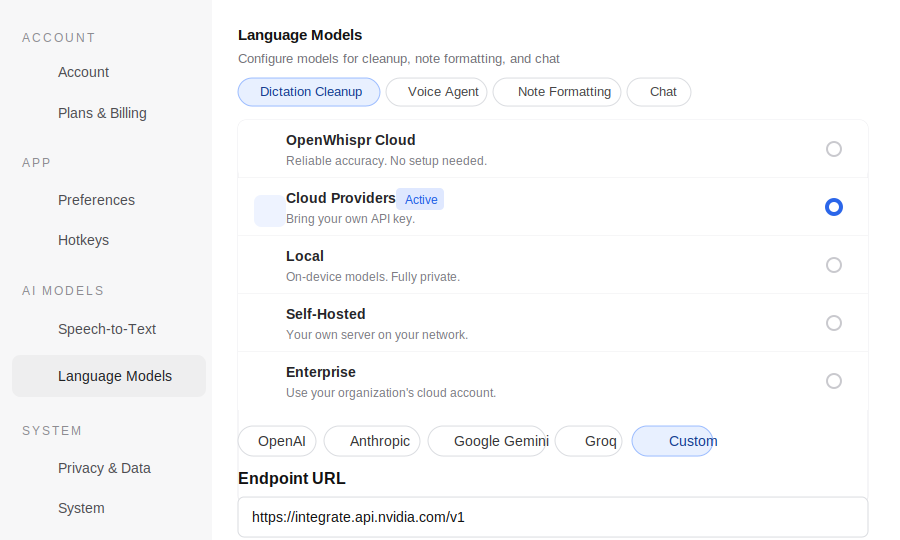
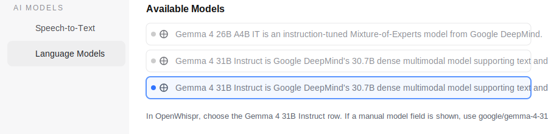

# Qwen3-ASR OpenWhispr Bridge

這個專案會在 Linux 或 Windows 本機啟動一個 OpenAI-compatible 語音轉文字 API，讓
[OpenWhispr](https://github.com/OpenWhispr/openwhispr) 的 `Self-Hosted` 模式可以使用
[Qwen3-ASR](https://github.com/QwenLM/Qwen3-ASR) 模型。

目標是做一個可免費自架、可用快捷鍵語音輸入到 Terminal 的 ASR pipeline：OpenWhispr
負責快捷鍵、錄音與貼上，本專案負責把 OpenWhispr 傳來的音檔交給 Qwen3-ASR 轉文字。

## 系統需求

- Linux 桌面環境，或 Windows 10/11 x64
- Python 3.12，由 `uv` 管理
- `ffmpeg`
- NVIDIA GPU 建議使用，CPU 也可嘗試但延遲會明顯變高
- OpenWhispr 桌面版

## 平台可行性

- OpenWhispr 官方支援 Windows、macOS、Linux；Windows 需求是 Windows 10+ x64，並提供
  `.exe` installer、push-to-talk 與 Windows Terminal 自動貼上處理。
- 本專案的 FastAPI bridge 本身是 Python/uv 專案，程式碼可跨平台執行。
- Linux 是目前已實測主路徑，使用 `run_qwen_asr.sh` 和 `systemd --user` 管理背景服務。
- Windows 原生可用 `run_qwen_asr.ps1` 啟動；它會先停止舊 process，再背景啟動服務並等待
  `/health`。但 `qwen-asr` 的音訊依賴包含 Python `sox` package，原生 Windows 若遇到
  SoX/CUDA 安裝問題，建議改用 WSL2 跑本服務，Windows 版 OpenWhispr 仍可連
  `http://127.0.0.1:8179/v1`。

Ubuntu 範例：

```bash
sudo apt update
sudo apt install -y ffmpeg curl
curl -LsSf https://astral.sh/uv/install.sh | sh
```

確認 GPU：

```bash
nvidia-smi
```

Windows PowerShell 範例：

```powershell
winget install --id=astral-sh.uv -e
winget install --id=Gyan.FFmpeg -e
```

## 從 GitHub 下載後直接啟動

Linux：

```bash
git clone https://github.com/Patrick-zhuyanxun/qwen-openwhispr-asr.git
cd qwen-openwhispr-asr
./run_qwen_asr.sh --model-size 0.6B
```

Windows PowerShell：

```powershell
git clone https://github.com/Patrick-zhuyanxun/qwen-openwhispr-asr.git
cd qwen-openwhispr-asr
powershell -ExecutionPolicy Bypass -File .\run_qwen_asr.ps1 -ModelSize 0.6B
```

第一次執行時，`uv` 會自動建立 `.venv` 並依照 `uv.lock` 安裝依賴；Qwen3-ASR 權重也會在
第一次載入模型時下載。

## OpenWhispr 設定

在 OpenWhispr 的 `Speech-to-Text` 設定中選 `Self-Hosted`，Server URL 填：

```text
http://127.0.0.1:8179/v1
```

## 可選：OpenWhispr 文字清理模型

如果你想讓 OpenWhispr 在語音轉文字後再做 AI 修正，例如移除口語 filler words、
修正標點、整理語法，可以到 OpenWhispr 的 `Language Models` 頁面設定。

這一段是文字後處理，不是 ASR 本體；ASR 仍然由本機 Qwen3-ASR bridge 負責。

設定畫面會像下面這樣：先選 `Cloud Providers`，下方 provider 選 `Custom`，再把
OpenRouter endpoint 與 API key 填進去。



目前建議直接使用 OpenRouter 的 OpenAI-compatible endpoint。Gemma 4 31B 在 OpenRouter
的 model id 是：

```text
google/gemma-4-31b-it
```

如果你想優先用免費 route，可以先試：

```text
google/gemma-4-31b-it:free
```

免費 route 可能會被限流或暫時不可用；如果 OpenWhispr `Test` 不穩，改回
`google/gemma-4-31b-it`。

設定方式：

1. 開啟 `Language Models`
2. 選 `Dictation Cleanup`
3. 打開 `Enable text cleanup`
4. 選 `Cloud Providers`
5. 下方 provider 選 `Custom`
6. `Endpoint URL` 填：

```text
https://openrouter.ai/api/v1
```

7. `API Key` 填你的 OpenRouter API key
8. 如果畫面有 `Model` 或 `Model ID` 欄位，可以選或填：

```text
google/gemma-4-31b-it
```

如果 OpenWhispr 會載入 `Available Models` 清單，可以按 `Refresh` 後選
`Gemma 4 31B Instruct`。如果清單有重複項目，選任一個 `Gemma 4 31B Instruct` 即可；
手動填寫時仍以 `google/gemma-4-31b-it` 為準。



OpenRouter 的 endpoint 是 OpenAI-compatible，所以 OpenWhispr 的 `Custom` cloud provider
可以直接使用，不需要本專案轉接。這是目前建議的文字清理設定。

舊版做法是把 OpenWhispr 的 `Custom` provider 指到本機
`http://127.0.0.1:8179/v1`，再由本服務把請求轉成 Google Gemini API。這個路徑仍保留在
程式裡當備用，但不再作為建議方案，因為 Gemma/Gemini 容易把 OpenWhispr 的 cleanup
prompt 原文一起輸出。

## 啟動或更換模型

只需要執行同一個腳本。每次執行時，它都會先停止舊的
`qwen-openwhispr-asr.service`，清掉殘留的 Qwen ASR process，然後重新用
`systemd --user` 啟動新的背景服務。

預設使用 `Qwen/Qwen3-ASR-0.6B`：

```bash
./run_qwen_asr.sh
```

Windows：

```powershell
powershell -ExecutionPolicy Bypass -File .\run_qwen_asr.ps1
```

指定模型大小：

```bash
./run_qwen_asr.sh --model-size 0.6B
./run_qwen_asr.sh --model-size 1.7B
```

Windows：

```powershell
powershell -ExecutionPolicy Bypass -File .\run_qwen_asr.ps1 -ModelSize 0.6B
powershell -ExecutionPolicy Bypass -File .\run_qwen_asr.ps1 -ModelSize 1.7B
```

切換模型時不需要手動停止舊服務，直接執行：

```bash
./run_qwen_asr.sh --model-size 1.7B
```

腳本會自動處理停止舊服務、清理殘留 process、啟動新服務、等待 health check。
Windows 的 `run_qwen_asr.ps1` 也會做同樣處理，日誌放在 `.logs/`。

也可以用環境變數：

```bash
QWEN_ASR_MODEL_SIZE=1.7B ./run_qwen_asr.sh
QWEN_ASR_DTYPE=float16 ./run_qwen_asr.sh
QWEN_ASR_PORT=8179 ./run_qwen_asr.sh
```

OpenRouter cleanup 直接由 OpenWhispr 呼叫，不需要把 OpenRouter API key 放進本服務的
環境變數；直接填在 OpenWhispr 的 `API Key` 欄位即可。

## 模型選擇建議

`0.6B` 是日常快捷輸入的建議預設：啟動較快、顯存壓力較低、延遲較小，適合在
Terminal 與 AI 對話時頻繁短句輸入。

`1.7B` 適合你更重視準確度，或要處理較長語音、混合中英文、專有名詞較多的內容。
代價是第一次下載較久、載入較慢、顯存與推理時間都會增加。

目前這台機器有 NVIDIA RTX A5000，兩個模型理論上都能跑；如果主要目標是「快捷輸入」，
先用 `0.6B` 比較實際。需要更高準確度時再切到 `1.7B`。

## 檢查是否開啟

服務狀態：

```bash
systemctl --user is-active qwen-openwhispr-asr.service
systemctl --user status qwen-openwhispr-asr.service --no-pager
journalctl --user-unit=qwen-openwhispr-asr.service -n 80 --no-pager
```

HTTP health check：

```bash
curl http://127.0.0.1:8179/health
```

Windows PowerShell：

```powershell
Invoke-RestMethod http://127.0.0.1:8179/health
```

正常會看到類似：

```json
{"ok":true,"model":"Qwen/Qwen3-ASR-0.6B","loaded":true,"cuda_available":true}
```

## API

OpenWhispr 會呼叫這個 endpoint：

```text
POST /v1/audio/transcriptions
```

本服務也支援：

- `POST /audio/transcriptions`
- `POST /v1/chat/completions`
- `POST /v1/responses`
- `GET /health`
- `GET /v1/models`
- `GET /models`

## 手動測試轉錄

把任意音檔傳到 endpoint：

```bash
curl -X POST http://127.0.0.1:8179/v1/audio/transcriptions \
  -F file=@/path/to/audio.webm \
  -F model=Qwen/Qwen3-ASR-0.6B \
  -F language=auto
```

正常會回傳：

```json
{"text":"..."}
```

如果要在終端機手動測試 OpenRouter cleanup，可以直接打 OpenRouter：

```bash
curl -X POST https://openrouter.ai/api/v1/chat/completions \
  -H "Authorization: Bearer $OPENROUTER_API_KEY" \
  -H "Content-Type: application/json" \
  -d '{
    "model": "google/gemma-4-31b-it",
    "messages": [
      {"role": "system", "content": "Clean up dictation text. Return only the corrected text."},
      {"role": "user", "content": "呃 幫我 修正 這段話 的 標點"}
    ]
  }'
```

查看本機 ASR 服務狀態：

```bash
curl http://127.0.0.1:8179/health
```

## 常見問題

### Port 8179 被佔用

直接重新執行腳本即可，它會先停掉舊服務與殘留 process。

Linux：

```bash
./run_qwen_asr.sh --model-size 0.6B
```

Windows：

```powershell
powershell -ExecutionPolicy Bypass -File .\run_qwen_asr.ps1 -ModelSize 0.6B
```

### 想停止服務

Linux：

```bash
systemctl --user stop qwen-openwhispr-asr.service
```

Windows：

```powershell
$asrPid = Get-Content .\.logs\qwen-openwhispr-asr.pid
taskkill /PID $asrPid /T /F
```

### 查看錯誤日誌

Linux：

```bash
journalctl --user-unit=qwen-openwhispr-asr.service -n 120 --no-pager
```

OpenRouter cleanup 不會經過本機服務，所以本機日誌只會看到 ASR 相關訊息。可以用：

```bash
journalctl --user --since "10 minutes ago" --no-pager | rg "Uvicorn|Qwen3-ASR"
```

Windows 日誌在：

```text
.logs/qwen-openwhispr-asr.out.log
.logs/qwen-openwhispr-asr.err.log
```

### 文字清理回傳整段 prompt

如果 OpenWhispr 的 cleaned text 變成 `Input:`、`Role:`、`Task:` 這類提示詞原文，代表
language model 把 OpenWhispr 的 cleanup prompt 當成一般文字處理了。先確認 OpenWhispr
的 `Language Models` 設定是 OpenRouter，而不是本機 Gemini proxy：

```text
Provider: Custom
Endpoint URL: https://openrouter.ai/api/v1
Model: google/gemma-4-31b-it
```

如果 Gemma 4 31B 仍然把 prompt 原文輸出，短句 cleanup 可改用
`deepseek/deepseek-v4-flash` 作為備援。

### 第一次啟動很久

第一次會下載 Python 依賴與 Qwen3-ASR 權重，屬於正常現象。後續啟動會快很多。

## Rust 替代方案

[second-state/qwen3_asr_rs](https://github.com/second-state/qwen3_asr_rs) 也提供
OpenAI-compatible 的 `asr-server`，endpoint 同樣是 `POST /v1/audio/transcriptions`。
如果之後想改成單一 Rust binary，可以把它當成這個 Python bridge 的替代方案。
